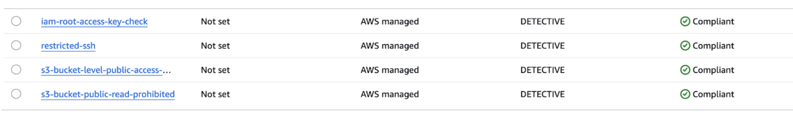
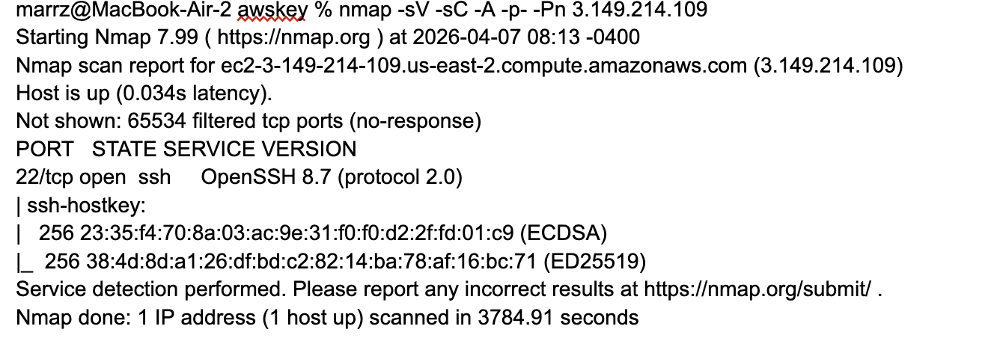
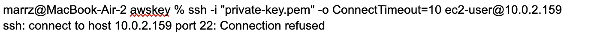
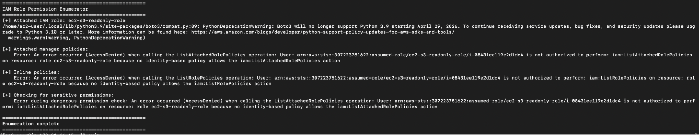
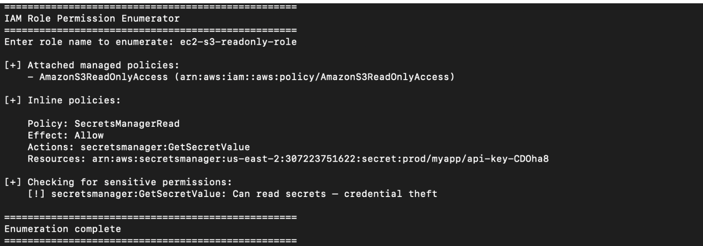

# AWS Cloud Security Lab

A hands-on cloud security engineering lab built on AWS, 
documenting the design and deployment of a hardened 
multi-tier web application with a full detection and 
compliance monitoring stack.

Built as a portfolio project targeting cloud security 
engineering roles — December 2026 graduation.

## Architecture

### What's deployed

**Network layer**
- Custom VPC (10.0.0.0/16) with public and private subnets
- Internet Gateway attached to public subnet only
- Bastion host pattern — only SSH entry point, restricted 
  to admin IP
- Application Load Balancer in public subnet — sole 
  internet-facing web entry point
- Private EC2 web server with no public IP, unreachable 
  directly from internet
- VPC Flow Logs enabled — all traffic logged to CloudWatch

**Identity & access**
- IAM least privilege throughout — every role scoped to 
  minimum required permissions
- No root access keys (verified via AWS Config rule)
- MFA enforced on root account
- EC2 instance roles used instead of access keys — 
  no long-term credentials on instances

**Detection & monitoring**
- CloudTrail — write-only management event logging 
  delivered to locked-down S3 bucket and CloudWatch Logs
- CloudWatch metric filter + alarm — fires on any root 
  account login, delivers SNS email alert
- AWS Config — 4 managed compliance rules continuously 
  evaluated
- VPC Flow Logs — network-layer visibility, compensating 
  control for GuardDuty gap

**Storage security**
- S3 Block Public Access — all 4 controls enabled
- SSE-S3 encryption at rest
- Versioning enabled
- Bucket policy explicitly scoped to required AWS services 
  only (CloudTrail, Config)

**Secrets management**
- AWS Secrets Manager for credential storage
- Boto3 retrieval script — zero hardcoded credentials 
  in code
- Secret rotation verified — application continues 
  working without code changes

## AWS Config Compliance Rules

| Rule | Status |
|---|---|
| iam-root-access-key-check | Compliant |
| restricted-ssh | Compliant |
| s3-bucket-public-read-prohibited | Compliant |
| s3-bucket-level-public-access-prohibited | Compliant |

## Security Assessment — Day 8

An authorized port scan and access attempt was conducted 
against the deployed infrastructure to validate defensive 
controls.

**nmap scan — bastion host**
PORT   STATE    SERVICE  VERSION
22/tcp open     ssh      OpenSSH 8.7 (protocol 2.0)
65534 ports filtered
Only port 22 reachable. Security group correctly blocks 
all other ports.

**Direct access attempt — private EC2**
ssh: connect to host 10.0.2.159 port 22: Connection refused
RFC 1918 address not routable from internet. Private 
subnet has no IGW route — independent of security group 
rules.

**ALB access — working as intended**
curl http://security-lab-alb-148942645.us-east-2.elb.amazonaws.com → 200 OK — Apache page served via private EC2

Internet → ALB → private EC2 path works. Private EC2 
has no direct internet exposure.

Full assessment in [reports/security-lab-incident-report.md]
(reports/security-lab-incident-report.md)

---

## Scripts

### `scripts/get_secret.py`
Retrieves a secret from AWS Secrets Manager at runtime 
using the EC2 instance role. No hardcoded credentials. 
Demonstrates correct secrets management pattern vs 
credential hardcoding.

### `scripts/enum_permissions.py`
IAM privilege enumeration tool replicating the 
post-exploitation technique from the Capital One 2019 
breach. Queries the EC2 metadata endpoint to discover 
the attached role, then maps all attached and inline 
policies, flagging permissions with lateral movement 
or exfiltration potential.

Demonstrated two scenarios:
- EC2 with least-privilege role: enumeration blocked 
  at iam:ListAttachedRolePolicies — attacker hits wall
- Over-privileged IAM identity: full policy map exposed

---

## Known Gaps & What I'd Add Next

| Gap | Impact | Remediation |
|---|---|---|
| No WAF | OWASP Top 10 attacks reach web server unfiltered | Attach WAF Web ACL with AWS-AWSManagedRulesCommonRuleSet to ALB |
| No GuardDuty | Port scans and behavioral anomalies not detected in real time | Enable GuardDuty — Recon:EC2/Portscan would have fired on Day 8 nmap scan |
| HTTP only, no HTTPS | Traffic between user and ALB is unencrypted | ACM certificate + HTTP→HTTPS redirect on ALB |
| Manual Config remediation | Exposure window measured in hours not seconds | Lambda auto-remediation triggered by Config rule violations |
| No S3 Object Lock | Attacker with IAM access could delete CloudTrail logs | Enable WORM storage on log bucket — logs become tamper-proof |
| IMDSv2 not enforced | SSRF attacks can still hit metadata endpoint | Enforce IMDSv2 on all EC2 instances — closes Capital One attack vector |

---

## Key Takeaways by Day

**Day 1** — Security groups as stateful firewalls. 
Port 22 from 0.0.0.0/0 exposes instances to automated 
brute force within minutes of launch.

**Day 2** — IAM least privilege in practice. Capital One 
breach: SSRF + over-privileged role + unprotected S3 = 
100M records exfiltrated. Metadata endpoint hands 
temporary credentials to anyone who can reach it.

**Day 3** — VPC network segmentation. Public/private 
distinction is a single route table entry. Bastion 
pattern contains SSH exposure to one hardened host.

**Day 4** — CloudTrail vs CloudWatch. Trail records, 
Watch detects. Root login alarm is a real SOC rule. 
CloudTrail Event History has a regional filter that 
hides global service events — use CloudWatch Logs 
search instead.

**Day 5** — Two different S3 rules catch two different 
failure modes. s3-bucket-public-read-prohibited catches 
active grants. s3-bucket-level-public-access-prohibited 
catches the removed safety net. Need both.

**Day 6** — Secrets Manager removes credentials from 
code entirely. Rotation is a 10-second console operation. 
IAM privilege enumeration via metadata endpoint is the 
first thing an attacker runs after EC2 compromise.

**Day 7** — 3-tier architecture: WAF → ALB → private EC2. 
ALB is the only internet-facing entry point. Private EC2 
disappears from the internet entirely.

**Day 8** — CloudTrail has a blind spot: it doesn't 
record network activity. VPC Flow Logs fill that gap. 
GuardDuty would have auto-detected the port scan as 
Recon:EC2/Portscan and fired an alert.

---

## Skills Demonstrated

AWS EC2 · VPC · IAM · S3 · CloudTrail · CloudWatch · 
AWS Config · Secrets Manager · ALB · VPC Flow Logs · 
Python/boto3 · nmap · SSH · Incident Response · 
Security Architecture · Least Privilege · 
Network Segmentation · Compliance Automation